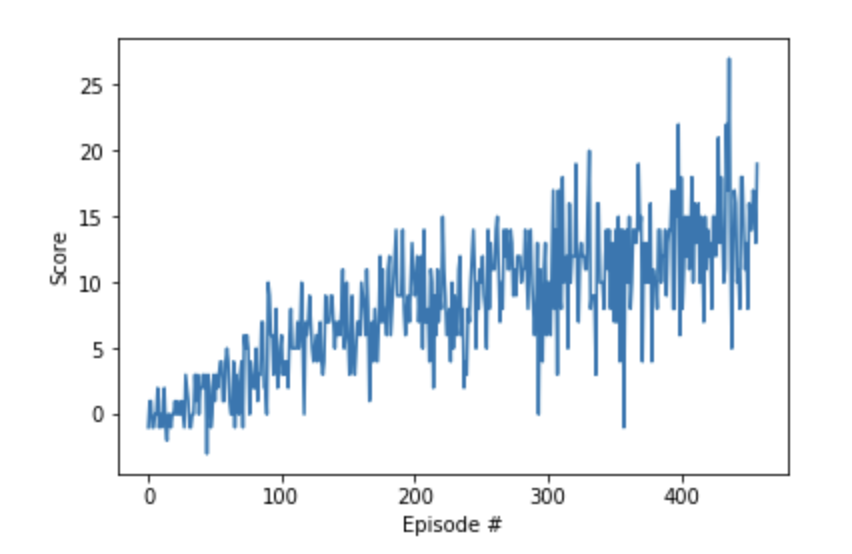

# Navigation

#### Environment

The simulation contains a single agent that navigates a large environment. At each time step, it has four actions at its disposal:

1. `0` - walk forward
1. `1` - walk backward
1. `2` - turn left
1. `3` - turn right

The state space has 37 dimensions and contains the agent's velocity, along with ray-based perception of objects around agent's forward direction. A reward of +1 is provided for collecting a yellow banana, and a reward of -1 is provided for collecting a blue banana. The goal of the agent is to collect as many yellow bananas as possible while avoiding blue bananas.

The task is episodic, and in order to solve the environment, the agent must get an average score of +13 over 100 consecutive episodes.

#### Prerequisites

This project requires some libraries to be installed. It is best if python environments are managed using a tool for that purpose (e.g. `conda`).

To install dependencies:
1. switch to python folder - `cd ../python`
1. run `pip install .`

You will also need to install Unity environment. Download the appropriate environment from the links below:

    - Linux: [click here](https://s3-us-west-1.amazonaws.com/udacity-drlnd/P1/Banana/Banana.app.zip)
    - Mac OSX: [click here](https://s3-us-west-1.amazonaws.com/udacity-drlnd/P1/Banana/Banana_Linux.zip)
    - Windows (32-bit): [click here](https://s3-us-west-1.amazonaws.com/udacity-drlnd/P1/Banana/Banana_Windows_x86.zip)
    - Windows (64-bit): [click here](https://s3-us-west-1.amazonaws.com/udacity-drlnd/P1/Banana/Banana_Windows_x86_64.zip)

Once the environment is downloaded ensure it is extraced in a folder in this project. The path to the environment can be adjusted in notebook (`Navigation.ipynb`). By default the code in the notebook will look for file called `Bannana.app` in root folder of this project.

#### Run or train the agent.

In order to train an agent or use a pretrained model as an agent start Jupyter and open `Navigation` notebook.

* Run command `jupyter notebook` from root of this project.
* Open `Navigation` notebook.

#### Rewards

In the following graph we can see how the agent progressed with learning. We can see that the reward that agent gets on average keeps increasing over time. If we let training process go for longer it is highly likely that agent would achieve better performance.

In the run associated with the graph above the agent achieved an average score of +13 after 458 episodes.

#### Ideas for Future Work

It would be interesting to try teaching the agent how to navigate the environment just from pixels. Another parameter that would be interesting to test is how does size of memory effect agents ability to learn. Is there a point at which memory is too large and inhibits agent's ability to learn? Another experiment worth trying is using some policy based method to learn instead of value based one. For example, using A3C or DDPG sounds interesting.