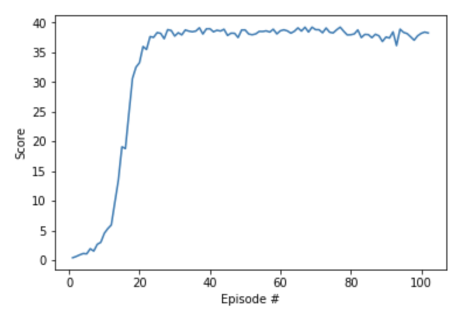

# Report

## Learning algorithm

The learning algorithm used is Deep Deterministic Policy Gradients (MADDPG). This algorithm uses multiple agents each with its own actor and critic network.

The actor network takes as input observations from the environment and returns what it believes is the best action to take. It has access to only its own observations. Critic network on the other hand takes in actions and states of the agent and outputs one number. That number represents belief about quality of the action that agent has taken. 

### Neural networks

#### Actor

Actor uses a neural network that consists of three fully connected layers and one batch normalization layer placed after the first fully connected layer. ReLU activation function is used with first (after batch normalization is applied) and second layer and `tanh` used with the last layer. `tanh` ensures that we get output in range (-1, 1).

#### Critic

Critic uses a neural network that consists of three fully connected layers and one batch normalization layer after the first fully connected layer. ReLU activation function used after first (after batch normalization is applied) and second layer. Output of the critic network is a single number. Also one thing to note is that actions are fed into the second fully connected layer instead of being passed together with states.

#### Hyperparameters

Hyperparameters used with Actor and Critic neural networks are as follows:

| Parameter | Value |
|---|---|
| Actor Learning Rate | 0.001 |
| Critic Learning Rate | 0.001 |
| Memory Size | 1e6 |
| Memory Batch Size | 1024 |
| Gamma (dicounting factor) | 0.99 |
| Tau | 1e-3 |

Following are descriptions of some of the above parameters that might not be straightforward to understand:

* **Memory Size** - Number of entries that can be stored in memory
* **Memory Batch Size** - Numer of entries that will be sampled from memory during learning 
* **Tau** - Rate at which new updated are blended into "fixed" (target) networks

### Rewards

In the above image it can be seen that the agent scores rewards of more then 30 quite early. In the notebook we can also see that at episode 101 the average rewards over 100 episodes was greater then 30 too.

### Ideas for future work

It would be interesting to explore using larger replay buffers as well as priorities experience replay instead of uniform sampling. Using A3C instead of DDPG is also an intersting path to explore.