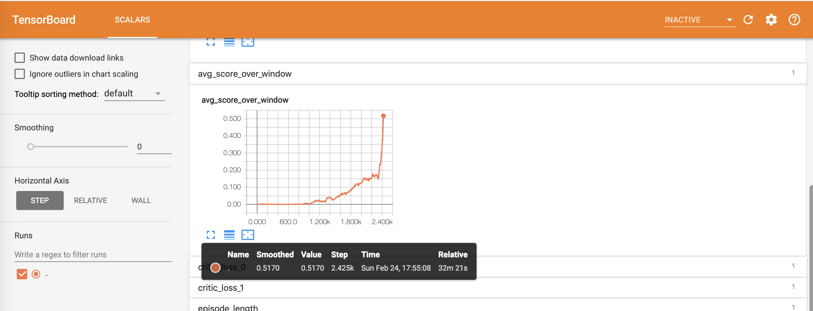

# Report

## Learning algorithm

The learning algorithm used is Multi Agent Deep Deterministic Policy Gradients (MADDPG). The algorithm uses two agents each with their set of neural networks (actor and critic).

The actor network takes as input observations from the environment and returns what it believes is the best action to take. It has access to only its own observations. Critic network on the other hand takes in actions and states of **both** agents and outputs one number. That number represents belief about quality of the action that agent has taken. 

### Neural networks

#### Actor

Actor uses a neural network that consists of three fully connected layers. With the ReLU activation function used with first and second layer and `tanh` used with the last layer.

#### Critic

Critic uses a neural network that consists of three fully connected layers. With the ReLU activation function used with first and second layer. The output of the last layer is used as is.

#### Hyperparameters

Hyperparameters used with Actor and Critic neural networks are as follows:

| Parameter | Value |
|---|---|
| Agent Learning Rate | 0.001 |
| Critic Learning Rate | 0.001 |
| Memory Size | 1e6 |
| Memory Batch Size | 512 |
| Gamma (dicounting factor) | 0.99 |
| Tau | 0.02 |

Following are descriptions of some of the above parameters that might not be straightforward to understand:

* **Memory Size** - Number of entries that can be stored in memory
* **Memory Batch Size** - Numer of entries that will be sampled from memory during learning 
* **Tau** - Rate at which new updated are blended into "fixed" (target) networks

### Rewards

In the above image it can be seen that the environment was solved in 2425 steps.

### Ideas for future work

Now that I know that the implementation of MADDPG algorithm works with the parameters used it would be interesting to try neural networks with larger number of parameters. It would also be interesting to try and increase memory to something even bigger and see whether this helps agents learn better. With the above configuration I was able to get average score to about 1.7 but I suspect that if network was larger (had more parameters) it could learn to play even better.